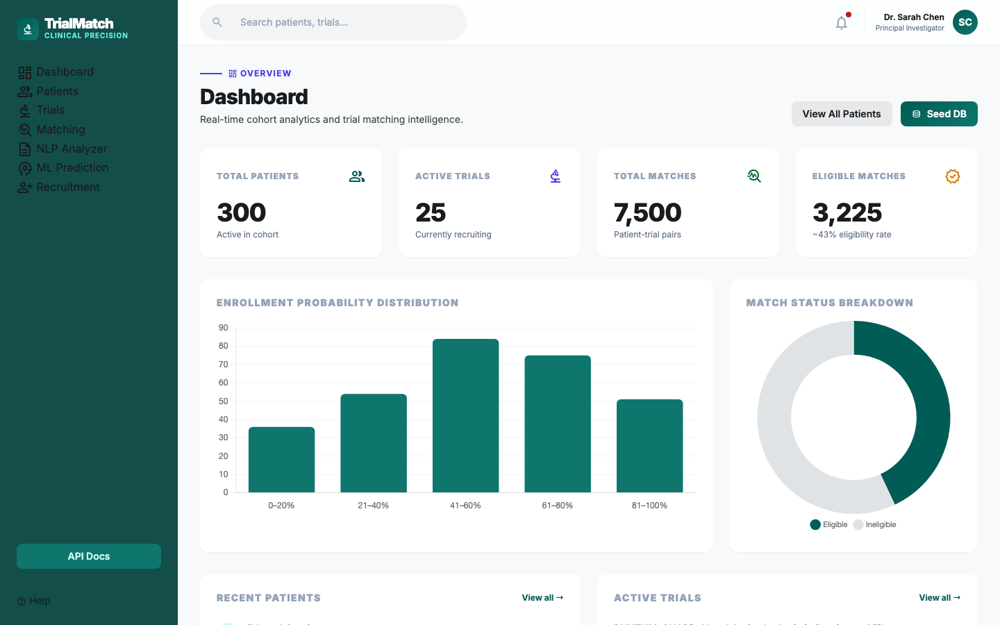
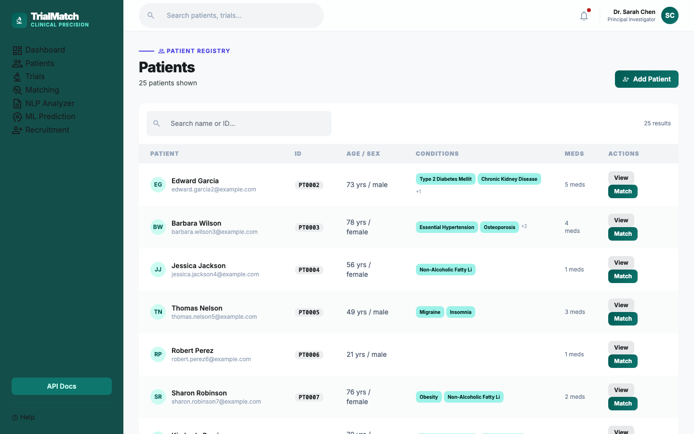
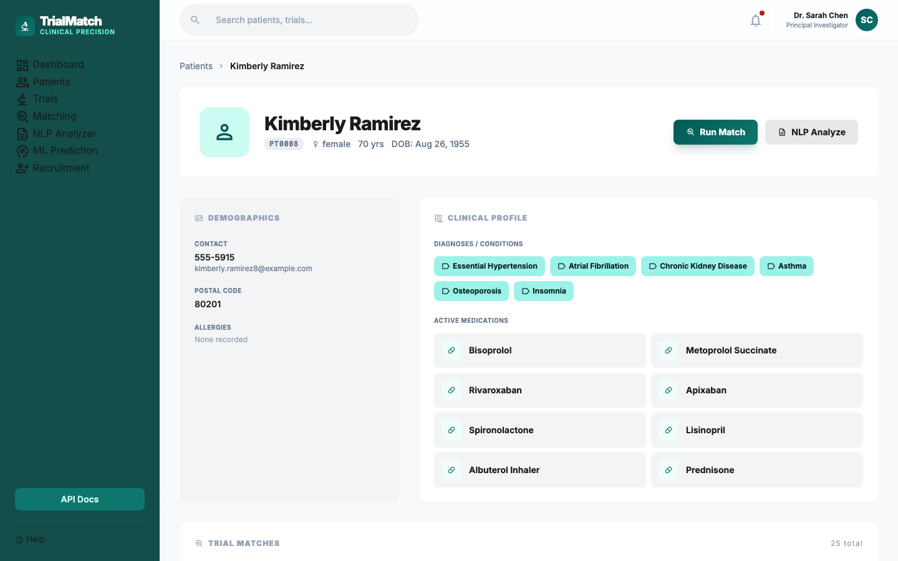
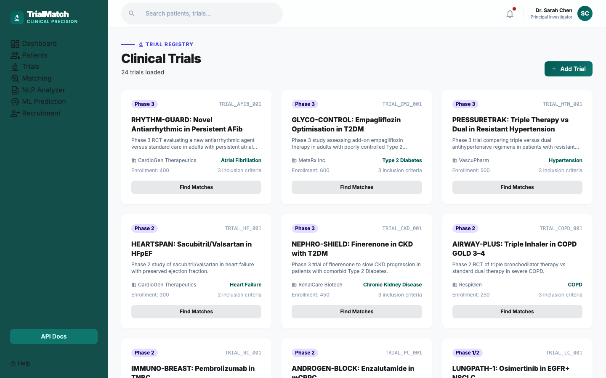
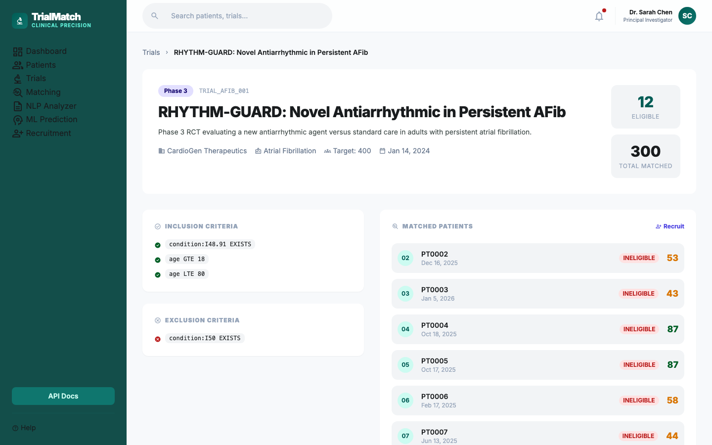
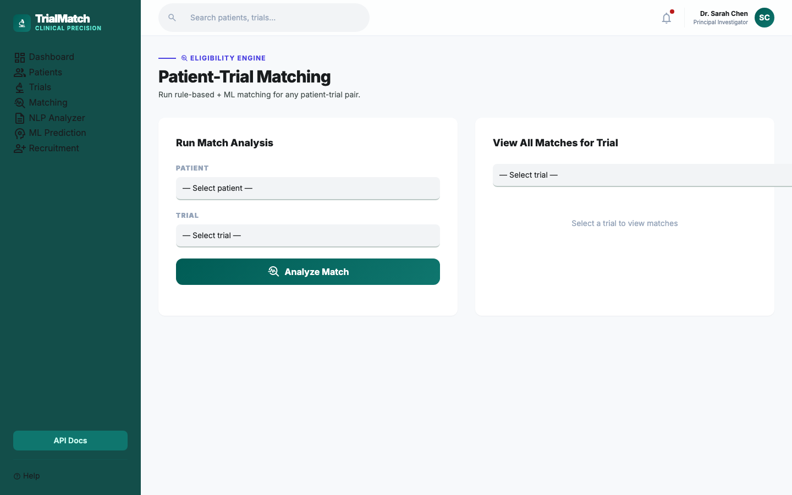
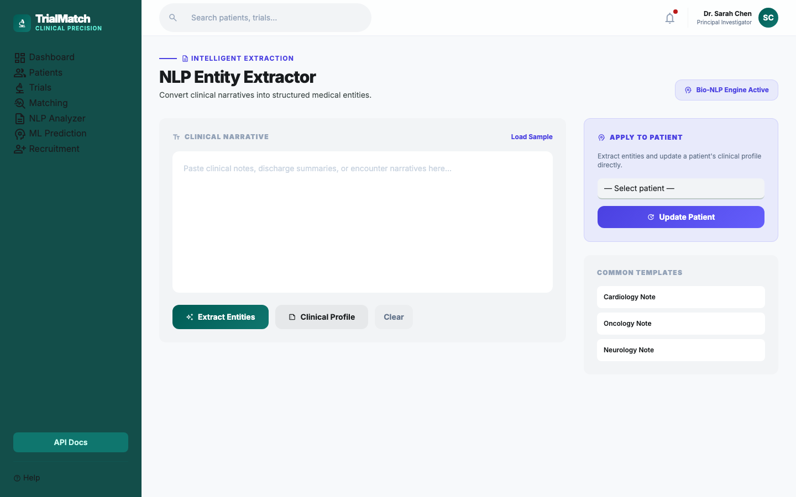
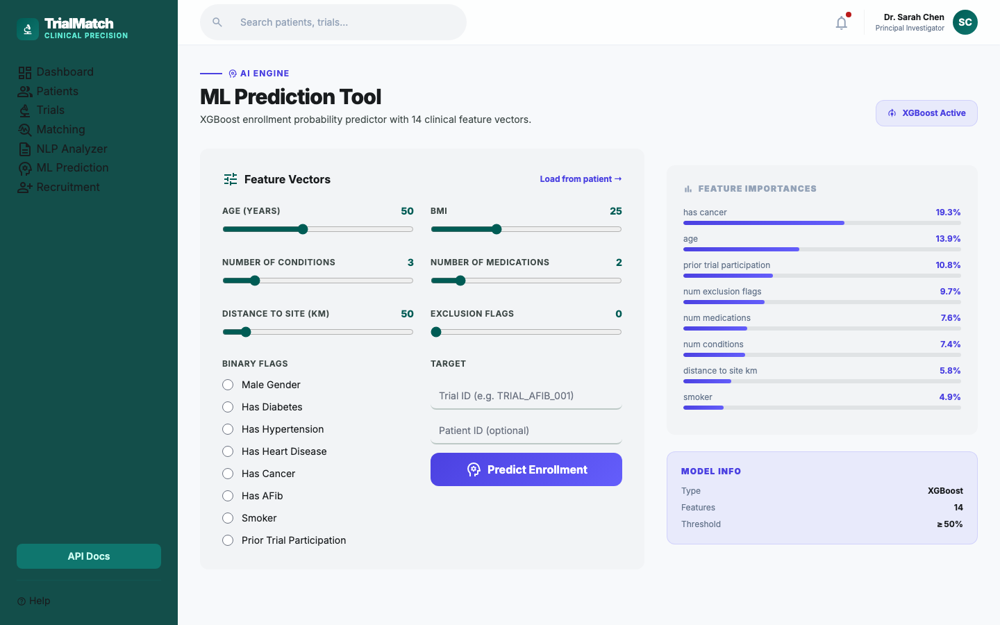
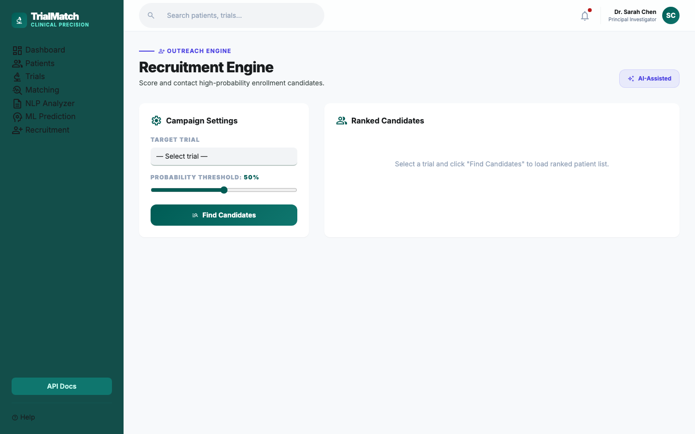

  

# Clinical Trial Cohort Matching System

**AI-powered patient-trial matching platform** using a React-style SPA, FastAPI, PostgreSQL, XGBoost ML, and Metabase analytics.

## Project Overview

Automates clinical trial patient recruitment through:
- Rule-based eligibility matching (all inclusion/exclusion criteria evaluated against ICD-10 coded conditions)
- Keyword NLP with negation detection for clinical note extraction
- XGBoost enrollment probability prediction (14 features)
- FHIR R4 client for EHR integration
- Async patient outreach recruitment engine
- Single-page application (SPA) connected live to the FastAPI backend
- Metabase analytics dashboard

---

## Screenshots

### Dashboard — 300 patients · 25 trials · 7,500 matches · 3,225 eligible


### Patient Registry — paginated list with conditions, medications, and quick-match


### Patient Detail — demographics, clinical profile, conditions, medications, trial matches


### Trial Catalogue — phase badges, sponsor, primary condition, eligibility stats


### Trial Detail — inclusion/exclusion criteria, matched patients, eligible count


### Patient-Trial Matching — run rule + ML match for any pair, view all trial matches


### NLP Entity Extractor — convert clinical narratives to structured medical entities


### ML Prediction Tool — XGBoost enrollment probability with 14 feature vectors


### Recruitment Engine — ranked candidate list with ML probability threshold filter


---

## Architecture

```
┌──────────────────────────────────────────────────────────────────┐
│              SPA  (index.html — hash-routed, Tailwind)           │
│  Dashboard · Patients · Trials · Matching · NLP · ML · Recruit   │
└─────────────────────────────┬────────────────────────────────────┘
                              │  REST / JSON (localhost:8000)
┌─────────────────────────────▼────────────────────────────────────┐
│                      FastAPI Server :8000                         │
├──────────────┬──────────────────┬───────────────┬────────────────┤
│  Patients /  │  Eligibility     │  ML Predict   │  Recruitment   │
│  Trials CRUD │  Matching Engine │  XGBoost      │  Engine        │
│  NLP Notes   │  ICD-10 Rules    │  Batch Score  │  Candidate     │
│  FHIR Import │  Criteria Eval   │  14 Features  │  Outreach      │
├──────────────┴──────────────────┴───────────────┴────────────────┤
│                  PostgreSQL 16 :5432  (trial_db)                  │
│        patients · trials · patient_trial_matches                  │
└──────────────────────────────┬───────────────────────────────────┘
                               ↓
             ┌─────────────────────────────┐
             │   Metabase Dashboard :3000  │
             │   Charts · Cohort funnels   │
             └─────────────────────────────┘
```

---

## Quick Start

### Prerequisites
- Docker & Docker Compose
- 4 GB RAM minimum

### Run

```bash
git clone <repo-url>
cd clinical-trial-cohort

# Start all services (API + PostgreSQL + Metabase)
docker compose up -d

# Seed 300 patients, 25 trials, 7,500 matches
curl -X POST http://localhost:8000/admin/seed

# Open the SPA
open index.html

# API docs (Swagger UI)
open http://localhost:8000/docs

# Metabase analytics
open http://localhost:3000
```

### Credentials (dev defaults — change via `.env`)
| Service | URL | Credentials |
|---|---|---|
| SPA | `index.html` (file or any static server) | No auth |
| API | http://localhost:8000 | No auth in dev (`API_KEY` unset) |
| Metabase | http://localhost:3000 | Set on first launch |
| PostgreSQL | localhost:5432 | `trialmatch / changeme` |

---

## API Endpoints

### Patients
| Method | Path | Description |
|---|---|---|
| `GET` | `/patients?skip=0&limit=50` | Paginated patient list |
| `POST` | `/patients` | Create patient |
| `GET` | `/patients/{id}` | Patient detail |
| `GET` | `/patients/{id}/matches` | All trial matches for a patient |
| `POST` | `/patients/{id}/analyze-notes` | NLP note analysis → update conditions/meds |

### Trials
| Method | Path | Description |
|---|---|---|
| `GET` | `/trials?skip=0&limit=50` | Paginated trial list |
| `POST` | `/trials` | Create trial |
| `GET` | `/trials/{id}` | Trial detail |

### Matching
| Method | Path | Description |
|---|---|---|
| `POST` | `/match/{patient_id}/{trial_id}` | Run rule + ML match (idempotent — 409 if already exists) |
| `GET` | `/matches/{trial_id}?status=ELIGIBLE` | Trial match list with filters |
| `GET` | `/patients/{id}/matches` | All matches for a patient |

### ML Prediction
| Method | Path | Description |
|---|---|---|
| `POST` | `/ml/predict` | Single enrollment probability |
| `POST` | `/ml/predict/batch` | Batch scoring, ranked by probability |
| `GET` | `/ml/model/info` | Feature importances |

### NLP
| Method | Path | Description |
|---|---|---|
| `POST` | `/nlp/extract-entities` | Extract conditions, medications, symptoms (with negation) |
| `POST` | `/nlp/clinical-profile` | Summarise disease burden |

### Recruitment
| Method | Path | Description |
|---|---|---|
| `GET` | `/recruitment/candidates/{trial_id}?threshold=0.5` | Ranked candidate list above ML threshold |
| `POST` | `/recruitment/notify/{patient_id}/{trial_id}` | Send recruitment notification to patient |

### FHIR
| Method | Path | Description |
|---|---|---|
| `POST` | `/fhir/import/{fhir_id}` | Fetch from FHIR server and upsert patient |

### Admin
| Method | Path | Description |
|---|---|---|
| `POST` | `/admin/seed` | Populate DB with 300 patients · 25 trials · 7,500 matches |
| `GET` | `/status` | Live record counts |

---

## Project Structure

```
clinical-trial-cohort/
├── index.html            # SPA — hash-routed, Tailwind CDN, Chart.js, live API
├── src/
│   ├── main.py           # FastAPI app — lifespan, CORS, auth, all routes
│   ├── models.py         # SQLAlchemy ORM — Patient, Trial, PatientTrialMatch
│   ├── schemas.py        # Pydantic v2 request/response schemas
│   ├── eligibility.py    # Rule-based matching engine (ICD-10 aware)
│   ├── nlp.py            # Keyword NLP with negation detection
│   ├── fhir.py           # FHIR R4 httpx client with mock fallback
│   ├── ml_prediction.py  # XGBoost classifier, joblib persistence
│   ├── recruitment.py    # Async recruitment batch engine
│   └── seed_data.py      # 300 patients · 25 trials · 7,500 matches
├── docs/screenshots/     # SPA screenshots (all 9 pages)
├── .env                  # Local credentials (gitignored)
├── .env.example          # Template
├── Dockerfile
├── docker-compose.yml
└── requirements.txt
```

---

## Tech Stack

| Layer | Technology |
|---|---|
| SPA | Vanilla JS, Tailwind CSS CDN, Chart.js 4.4, Material Symbols |
| API | FastAPI 0.104, Python 3.11 |
| Database | PostgreSQL 16 |
| ORM | SQLAlchemy 2.0 |
| ML | XGBoost 2.0+, scikit-learn 1.3, joblib |
| NLP | Keyword matching with negation detection |
| HTTP client | httpx (FHIR R4) |
| Analytics | Metabase |
| Container | Docker, Docker Compose |

---

## ML Model

**XGBoost Classifier** — trained on 1,000 synthetic patients, persisted as `enrollment_model.joblib`

| Hyperparameter | Value |
|---|---|
| Estimators | 100 |
| Max depth | 4 |
| Learning rate | 0.1 |
| Subsample | 0.8 |

**Top features by importance:**
| Rank | Feature | Importance |
|---|---|---|
| 1 | `has_cancer` | 19.3% |
| 2 | `age` | 13.9% |
| 3 | `prior_trial_participation` | 10.8% |
| 4 | `num_exclusion_flags` | 9.7% |
| 5 | `num_medications` | 7.6% |
| 6 | `num_conditions` | 7.4% |
| 7 | `distance_to_site_km` | 5.8% |
| 8 | `smoker` | 4.9% |

---

## Eligibility Logic

Each match stores **four scores**:

| Score | Range | Source |
|---|---|---|
| `rule_match_score` | 0–100 | Fraction of inclusion criteria met |
| `enrollment_probability` | 0.0–1.0 | Raw XGBoost output |
| `ml_match_score` | 0–100 | `enrollment_probability × 100` |
| `combined_score` | 0–100 | `50% rule + 50% ML` |

A patient is `ELIGIBLE` only when **all** inclusion criteria are met and **no** exclusion criteria are triggered. Criteria use structured operators: `EQ`, `GT`, `LT`, `GTE`, `LTE`, `IN`, `EXISTS`, `NOT_EXISTS`.

---

## Security

- Credentials in `.env` (not source); `.env.example` provided
- Optional API key auth — set `API_KEY` env var to enforce on all write endpoints
- `X-API-Key: <key>` header required when `API_KEY` is set
- SQL injection prevention via SQLAlchemy parameterised queries
- Unique constraint on `(patient_id, trial_id)` prevents duplicate match records
- CORS enabled for SPA-to-API communication

---

## License

MIT License — see [LICENSE](LICENSE)