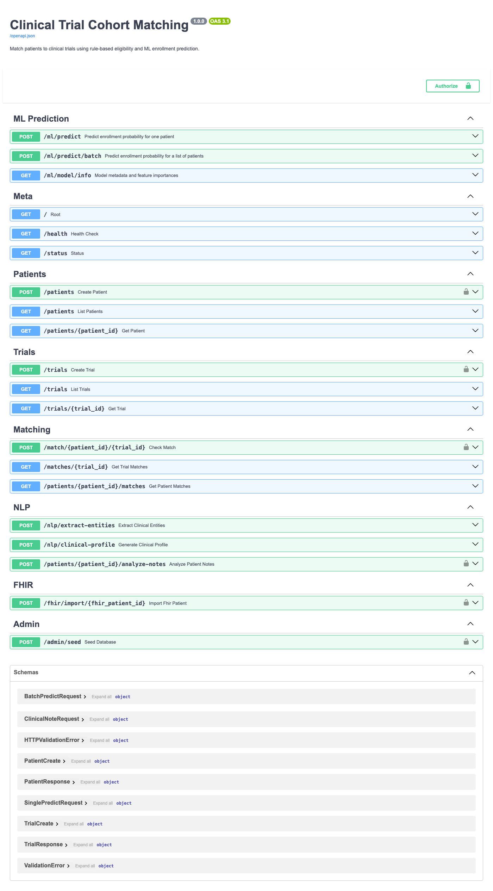
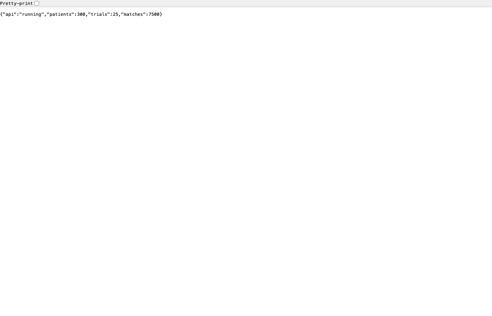
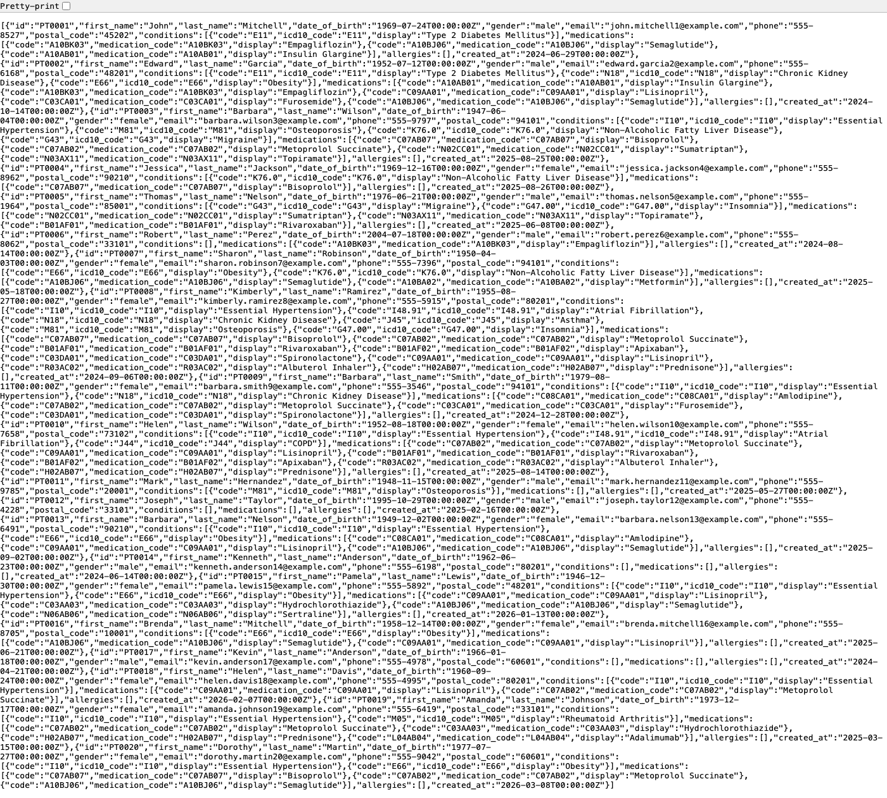
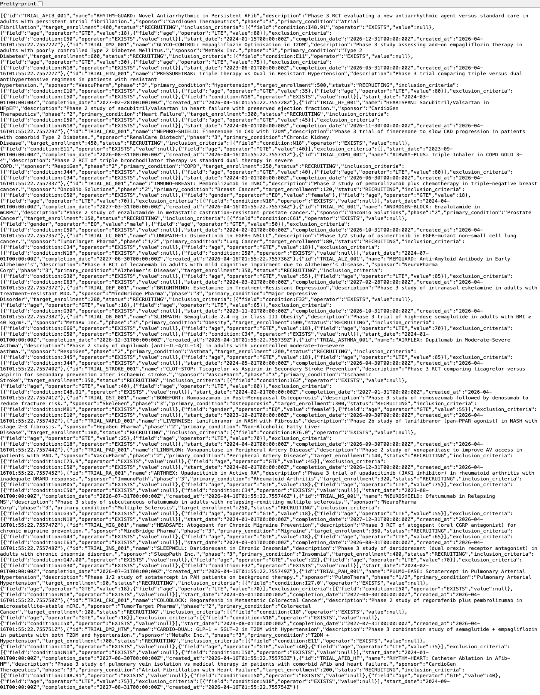
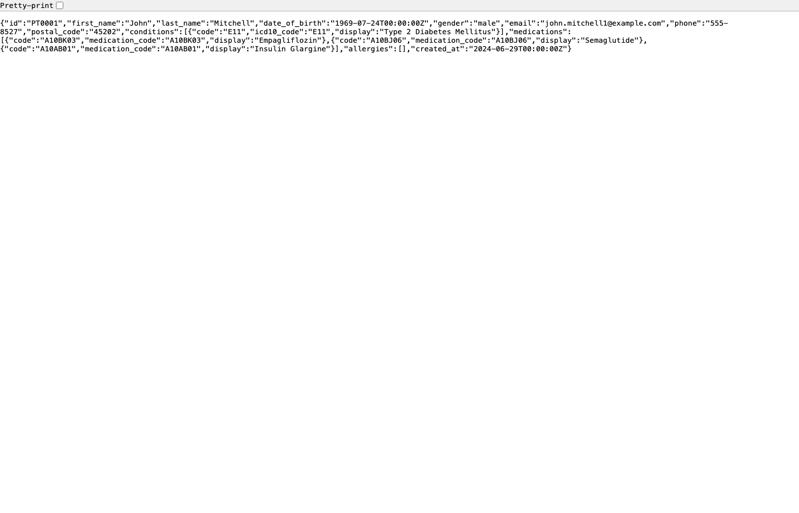
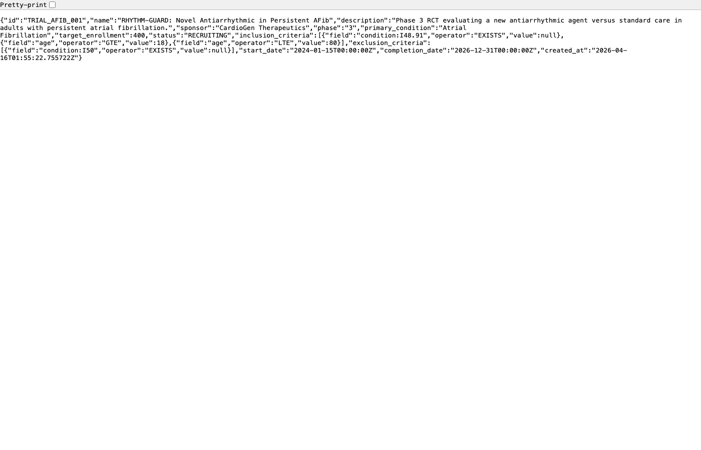
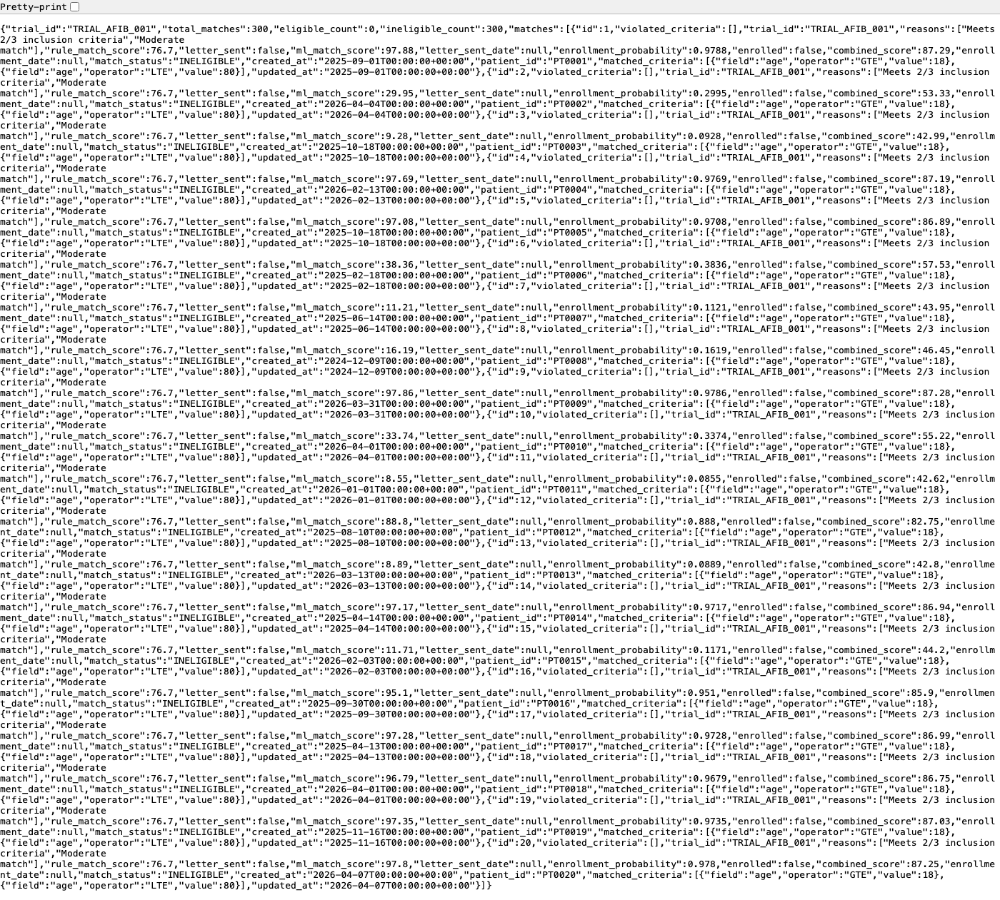
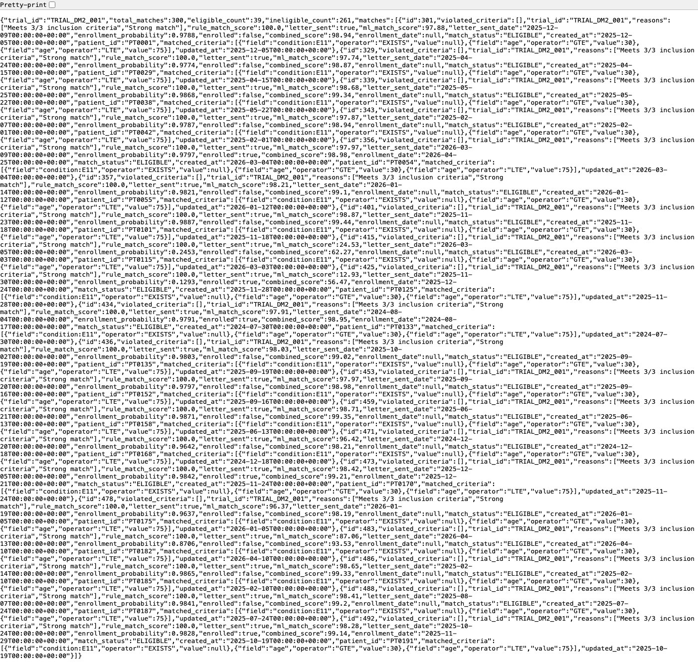
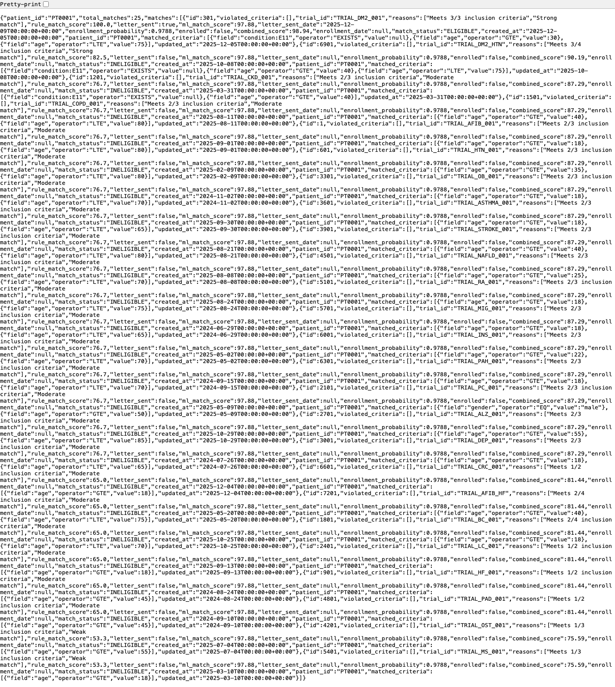
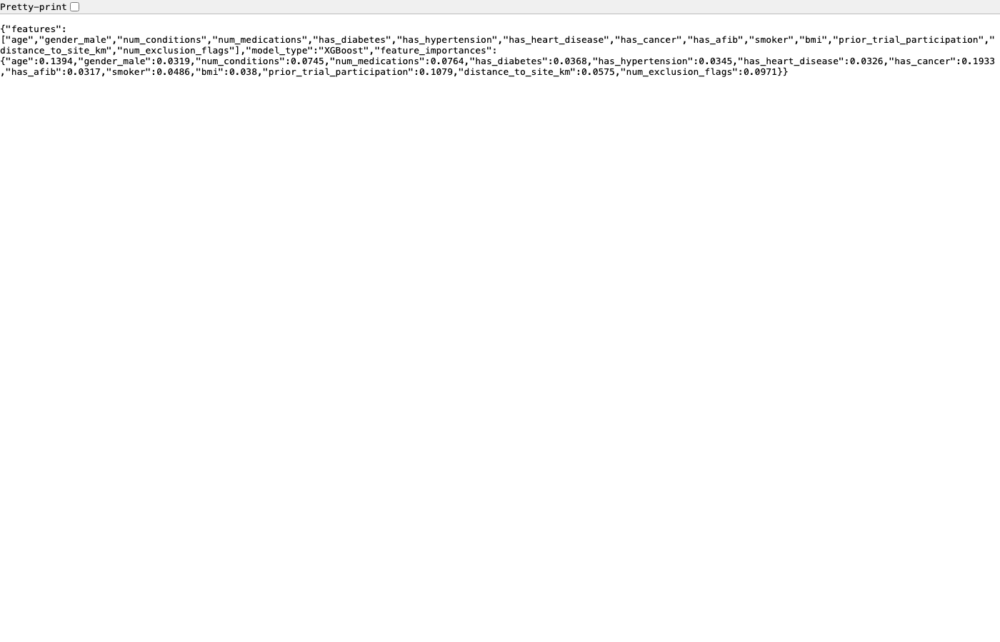

# Clinical Trial Cohort Matching System

**AI-powered patient-trial matching platform** using FastAPI, PostgreSQL, XGBoost ML, and Metabase analytics.

## Project Overview

Automates clinical trial patient recruitment through:
- Rule-based eligibility matching (all inclusion/exclusion criteria evaluated)
- Keyword NLP with negation detection for clinical note extraction
- XGBoost enrollment probability prediction (14 features)
- FHIR R4 client for EHR integration
- Metabase analytics dashboard
- Async patient outreach recruitment engine

## Screenshots

### API Documentation (Swagger UI)


### Live Status — 300 patients · 25 trials · 7 500 matches


### Patient List (paginated)


### Trial Catalogue


### Patient Detail


### Trial Detail


### Trial Matches


### Eligible Matches Only


### Patient Match History


### ML Model — XGBoost Feature Importances


### ReDoc API Reference


---

## Architecture

```
┌──────────────────────────────────────────────────────────┐
│                   FastAPI Server :8000                   │
├──────────────┬─────────────────┬────────────────────────┤
│  Patients /  │  Eligibility    │  ML Predictions        │
│  Trials CRUD │  Matching       │  XGBoost Classifier    │
│  NLP Notes   │  Rule Engine    │  Batch Scoring         │
│  FHIR Import │  All criteria   │  Feature Importance    │
├──────────────┴─────────────────┴────────────────────────┤
│              PostgreSQL 16 :5432  (trial_db)            │
│   patients · trials · patient_trial_matches             │
└──────────────────────────┬──────────────────────────────┘
                           ↓
          ┌────────────────────────────┐
          │   Metabase Dashboard :3000 │
          │   Charts · Cohort funnels  │
          └────────────────────────────┘
```

---

## Quick Start

### Prerequisites
- Docker & Docker Compose
- 4 GB RAM minimum

### Run

```bash
git clone <repo-url>
cd clinical-trial-cohort

# Start all services
docker compose up -d

# Wait ~15 s for the API to be ready
curl http://localhost:8000/health
# → {"status":"healthy"}

# Seed 300 patients, 25 trials, 7 500 matches
curl -X POST http://localhost:8000/admin/seed

# API docs
open http://localhost:8000/docs

# Metabase analytics
open http://localhost:3000
```

### Credentials (dev defaults — change via `.env`)
| Service | URL | Credentials |
|---|---|---|
| API | http://localhost:8000 | No auth in dev (`API_KEY` unset) |
| Metabase | http://localhost:3000 | Set on first launch |
| PostgreSQL | localhost:5432 | `trialmatch / changeme` |

---

## API Endpoints

### Patients
| Method | Path | Description |
|---|---|---|
| `GET` | `/patients?skip=0&limit=50` | Paginated patient list |
| `POST` | `/patients` | Create patient |
| `GET` | `/patients/{id}` | Patient detail |
| `GET` | `/patients/{id}/matches` | All trial matches for a patient |
| `POST` | `/patients/{id}/analyze-notes` | NLP note analysis → update conditions/meds |

### Trials
| Method | Path | Description |
|---|---|---|
| `GET` | `/trials?skip=0&limit=50` | Paginated trial list |
| `POST` | `/trials` | Create trial |
| `GET` | `/trials/{id}` | Trial detail |

### Matching
| Method | Path | Description |
|---|---|---|
| `POST` | `/match/{patient_id}/{trial_id}` | Run rule + ML match (idempotent — 409 if already exists) |
| `GET` | `/matches/{trial_id}?status=ELIGIBLE` | Trial match list with filters |

### ML Prediction
| Method | Path | Description |
|---|---|---|
| `POST` | `/ml/predict` | Single enrollment probability |
| `POST` | `/ml/predict/batch` | Batch scoring, ranked by probability |
| `GET` | `/ml/model/info` | Feature importances |

### NLP
| Method | Path | Description |
|---|---|---|
| `POST` | `/nlp/extract-entities` | Extract conditions, medications, symptoms (with negation) |
| `POST` | `/nlp/clinical-profile` | Summarise disease burden |

### FHIR
| Method | Path | Description |
|---|---|---|
| `POST` | `/fhir/import/{fhir_id}` | Fetch from FHIR server and upsert patient |

### Admin
| Method | Path | Description |
|---|---|---|
| `POST` | `/admin/seed` | Populate DB with 300 patients · 25 trials · 7 500 matches |
| `GET` | `/status` | Live record counts |

---

## Project Structure

```
clinical-trial-cohort/
├── src/
│   ├── main.py           # FastAPI app — lifespan, auth, all routes
│   ├── models.py         # SQLAlchemy ORM — Patient, Trial, PatientTrialMatch
│   ├── schemas.py        # Pydantic v2 request/response schemas
│   ├── eligibility.py    # Rule-based matching engine
│   ├── nlp.py            # Keyword NLP with negation detection
│   ├── fhir.py           # FHIR R4 httpx client with mock fallback
│   ├── ml_prediction.py  # XGBoost classifier, joblib persistence
│   ├── recruitment.py    # Async recruitment batch engine
│   └── seed_data.py      # 300 patients · 25 trials · 7 500 matches
├── docs/screenshots/     # All UI screenshots
├── .env                  # Local credentials (gitignored)
├── .env.example          # Template
├── Dockerfile
├── docker-compose.yml
└── requirements.txt
```

---

## Tech Stack

| Layer | Technology |
|---|---|
| API | FastAPI 0.104, Python 3.11 |
| Database | PostgreSQL 16 |
| ORM | SQLAlchemy 2.0 |
| ML | XGBoost 2.0+, scikit-learn 1.3, joblib |
| NLP | Keyword matching with negation detection |
| HTTP client | httpx (FHIR R4) |
| Analytics | Metabase |
| Container | Docker, Docker Compose |

---

## ML Model

**XGBoost Classifier** — trained on 1 000 synthetic patients, persisted as `enrollment_model.joblib`

| Hyperparameter | Value |
|---|---|
| Estimators | 100 |
| Max depth | 4 |
| Learning rate | 0.1 |
| Subsample | 0.8 |

**14 features** (top by importance):
1. `age` — 13.9%
2. `has_cancer` — 19.3%
3. `prior_trial_participation` — 10.8%
4. `num_exclusion_flags` — 9.7%
5. `num_medications` — 7.6%
6. `distance_to_site_km` — 5.8%
7. … (8 more)

---

## Eligibility Logic

Each match stores **four scores**:

| Score | Range | Source |
|---|---|---|
| `rule_match_score` | 0–100 | Fraction of inclusion criteria met |
| `enrollment_probability` | 0.0–1.0 | Raw XGBoost output |
| `ml_match_score` | 0–100 | `enrollment_probability × 100` |
| `combined_score` | 0–100 | `50% rule + 50% ML` |

A patient is `ELIGIBLE` only when **all** inclusion criteria are met and **no** exclusion criteria are triggered.

---

## Security

- Credentials in `.env` (not source); `.env.example` provided
- Optional API key auth — set `API_KEY` env var to enforce on all write endpoints
- `X-API-Key: <key>` header required when `API_KEY` is set
- SQL injection prevention via SQLAlchemy parameterised queries
- Unique constraint on `(patient_id, trial_id)` prevents duplicate match records

---

## License

MIT License — see [LICENSE](LICENSE)
